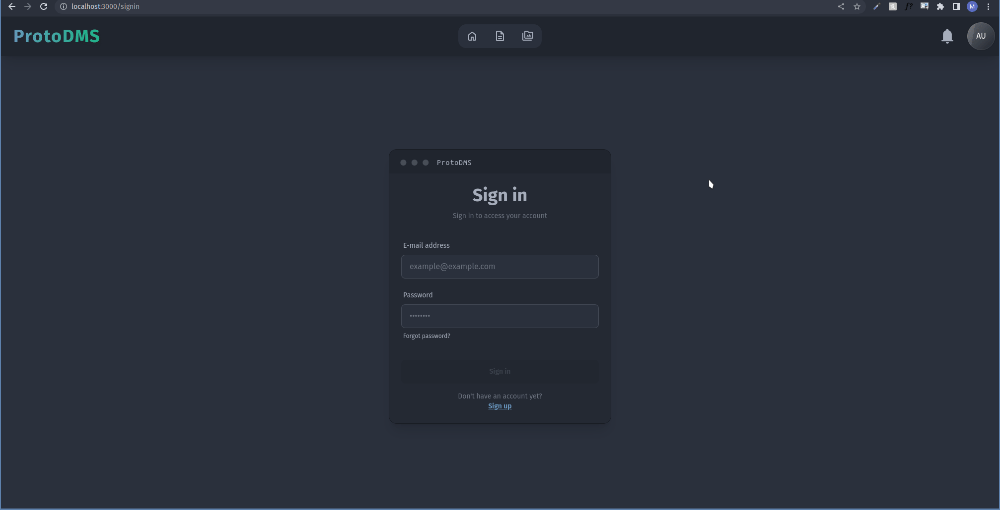
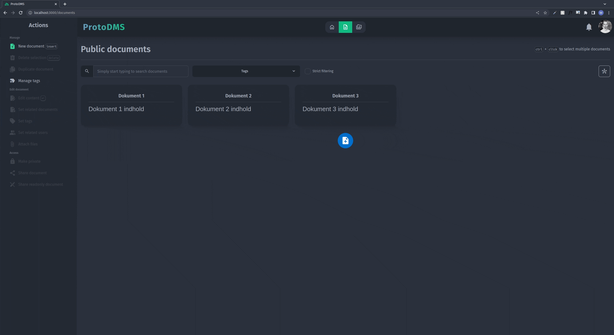
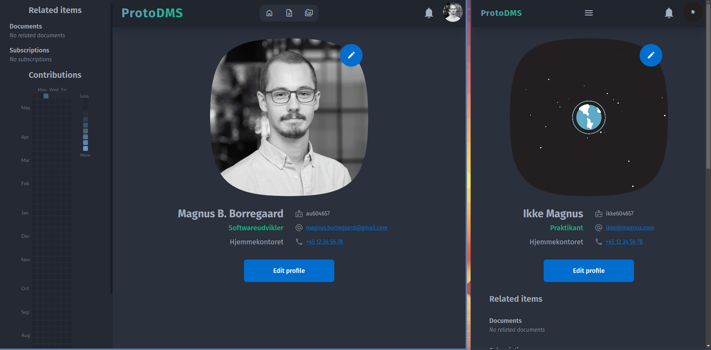
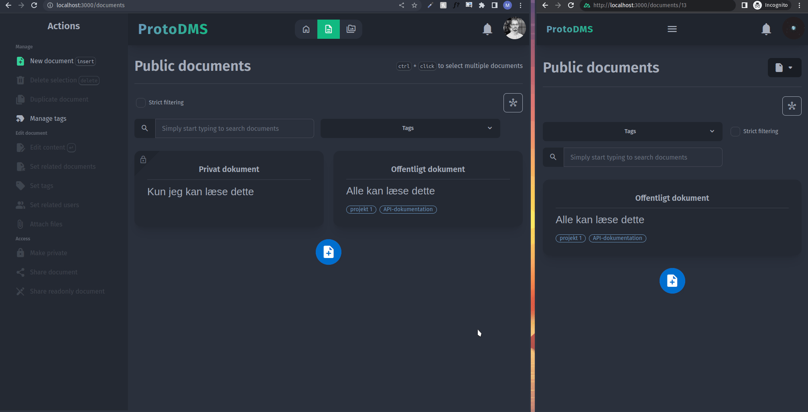
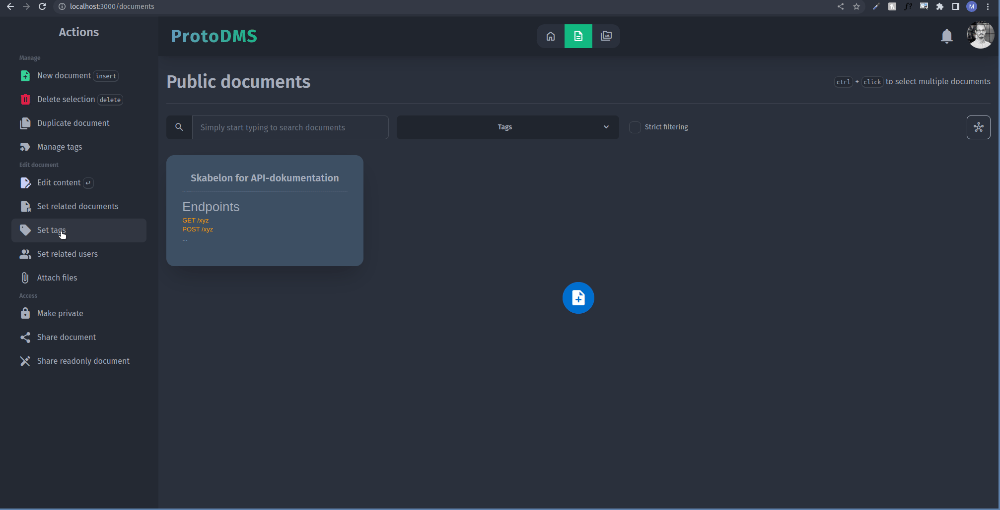
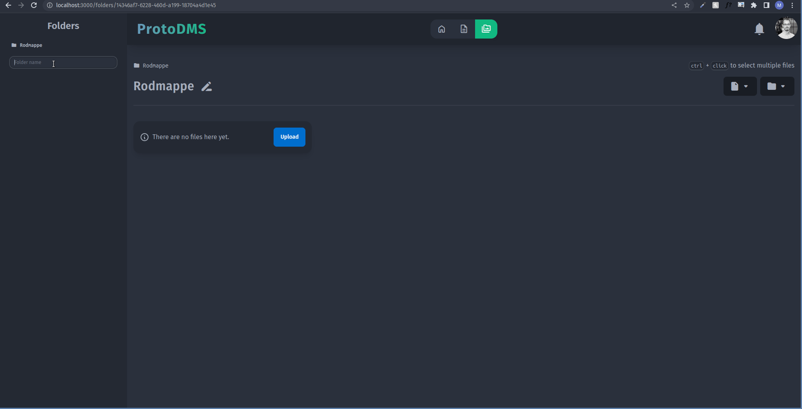
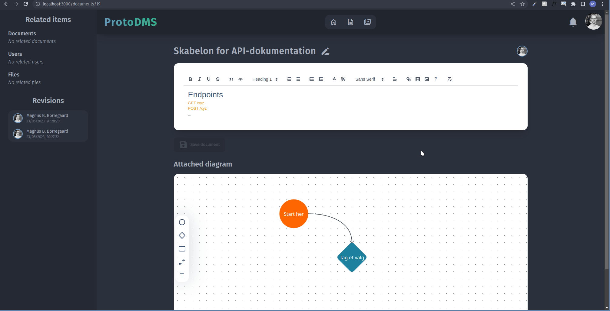
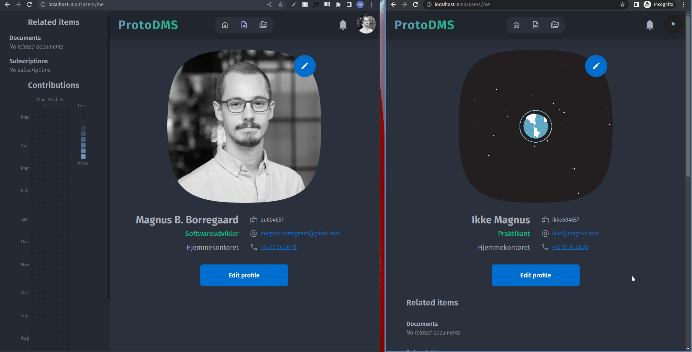

# ProtoDMS - [Live demo](https://dev3.documents.chcaa.au.dk)
jeg vil anbefale dig at logge ind med følgende testbruger, men du kan også oprette en ny profil ved at se illustrationen i [Registrering](#registrering):
```
E-mail: test@user.com
Password: password
```

Da der ikke er vigtige data på ProtoDMS, er der ingen begrænsninger for de handlinger, du som testbruger kan foretage dig.

Udover præsentationen af ProtoDMS' funktioner, der findes i denne README, vil der fremgå en gennemgang af platformens funktioner efter login.

## Disclaimer
Mangler, begrænsninger og fremtidigt arbeje ved de følgende funktioner adresserer udelukkende tekniske og / eller praktiske emner ved den aktuelle implementering af disse i relation til funktionerne beskrevet i mit speciale. For at læse om yderligere indsigter, der adresserer videndeling i projektbaserede softwareorganisationer henvises der til bilag 3 af mit speciale.

## Registrering
Da den live demo er til demonstrationsformål og ikke har reel data, er der ingen begrænsninger for, hvem der kan oprette en profil.



### Mangler, begrænsninger og fremtidigt arbejde
* Inden registrering kan anvendes i produktion, skal det ProtoDMS udbygges til at anvende et beskyttet invitationssystem, hvor kun administratoren eller andre medlemmer kan invitere nye brugere ved at sende en invitations-email. Alternativt kan kan hele adgangen til ProtoDMS (inkl. registrering) beskyttes bag en VPN eller lignende, der kræver autoriseret adgang
* Man kan i øjeblikket ikke fjerne sit profilbillede (kun ændre til et andet)
* Man kan i øjeblikket ikke slette sin egen profil (kun administratoren kan gøre dette)

## Relationer & grafvisning
Dokumentation i ProtoDMS organiseres i et netværk af relaterede dokumenter. Dette netværk kan visualiseres med grafvisningsknappen.



### Mangler, begrænsninger og fremtidigt arbejde
* Grundet vanskeligheder ved at definere tovejs-mange-til-mange-relationer mellem dokumenter (én enkelt SQL-samling) er relationen mellem dokumenter i øjeblikket énvejs
  * Dette betyder, at når dokumenter relateres til hinanden skal dette manuelt gøres to gange (fra hvert dokument) for at relationen mellem de to dokumenter kan ses fra begge dokumenter

## Mærkater & filtrering
Dokumenter kan facetteres og filtreres med brugervalgte mærkater, der kan denotere alt fra dokumenters kontekst til deres indhold og anvendelseskontekst. 


### Mangler, begrænsninger og fremtidigt arbejde
* Det kan potentielt hjælpe informationssøgere med hurtigt at identificere korrekte dokumenter, hvis man ved oprettelsen af mærkater også kan vælge mærkatets farve og / eller ikon

## Private dokumenter
Dokumenter i ProtoDMS kan være enten **private** eller **offentlige**. Offentlige dokumenter kan ses af alle, hvorimod alt ved private dokumenter kun kan ses af den oprettende bruger.



## Deling og skrivebeskyttet deling
Man kan dele et download-link til filer med andre brugere af ProtoDMS, så de ikke selv behøver at fremsøge filen. Man kan også oprette links til en skrivebeskyttet version af dokumentation, der kan sendes til personer uden adgang til ProtoDMS.



### Mangler, begrænsninger og fremtidigt arbejde
* ProtoDMS understøtter i øjeblikket ikke links til "skrivebeskyttede" **filer**, der kan sendes til personer uden adgang til platformen, da filer af deres natur ikke kan redigeres på ProtoDMS alligevel, og man derfor blot kan downloade en fil og sende den til modtageren igennem andre kanaler
  * Det ville dog være nyttigt at kunne oprette et sådant link, der kan deles med eksterne aktører (evt. via email, så man ikke behøver forlade ProtoDMS)

## Skabeloner
Brugere kan oprette skabeloner for dokumentation ved at tilføje et brugervalgt mærkat (eks. 'skabelon') til almindelige dokumenter og duplikere disse inden udfyldelse.



## Filer og OCR
Filer kan uploades i ProtoDMS' virtuelle filsystem og vedhæftes dokumentation. Indholdet af billedfiler kan dernæst scannes og indsættes i dokumenter for at gøre filindholdet søgbart.



### Mangler, begrænsninger og fremtidigt arbejde
* Oprettelsen af, og navigationen til fildokumentation kan i øjeblikket kun foretages fra dokumenters søgeside, ikke fra en bestemt fil
* Den aktuelle implementering af optisk karaktergenkendelse er lavet med [tesseract.js](https://github.com/naptha/tesseract.js) og kører derfor i klientens browser
  * Dette betyder, at brugere aktivt skal foretage scanningen i stedet for, at den kan foretages i baggrunden på serveren
  * Dette betyder også, at scanningen er begrænset af klientens hardware, hvor serverside-processering har potentiale for at fungere mere effektivt
  * Yderligere understøtter tesseract.js kun en lille håndfuld af billedformater, hvor understøttelse af PDF-formatet ville være en meget brugbar funktionalitet
  * tesseract.js understøtter automatisk rotering af billeder, hvilket ville være en brugbar tilførsel at implementere i ProtoDMS
  * tesseract.js understøtter mange sprog. I øjeblikket er ProtoDMS konfigureret til at genkende dansk og engelsk, men evnen til at kunne konfigurere sprogmodellen ville naturligvis gøre denne funktion brugbar for personer, der ofte uploader filer i andre sprog end disse

## Illustrationer
Hvert dokument har et vedhæftet diagram til at illustrere simple flowcharts, sekvensdiagrammer etc.



### Mangler, begrænsninger og fremtidigt arbejde
* Grundet den tekniske udformning af diagram-editoren er dette ikke helt realtids-synkroniseret med andre i samme dokument-session. I stedet skal man først gemme diagrammet, før det kan ses af andre redaktører, men dette påkræver ikke en opdatering af siden for de resterende redaktører
* Den implementerede diagram-funktionalitet er meget simpel og kan kun anvendes til simple flowcharts og sekvensdiagrammer (etc.)
  * En indlejret draw.io-editor vil tillade mere komplekse diagrammer (såsom UML-diagrammer), hvilket kan bruges til at understøtte præsentationen af langt flere softwareudviklingrelaterede emner
    * draw.io kræver dog at illustrationer gemmes i et specifikt format, der potentielt påkræver en server til lagring af disse, medmindre kildekoden af draw.io approprieres
  * Ideelt vil denne funktionalitet bestå af en editor magen til [Figmas](https://www.figma.com/), hvor arbitrære illustrationer (f.eks. også UI-designs og lignende) kan gemmes og arbejdes på i realtid med andre kollaboratører
* Grundet den tekniske udformning af diagram-editoren er det vanskeligt at have flere editors på samme side. Det ville være brugbart at kunne tilføje / fjerne fra en liste over arbitrære illustrationer med hver sin titel

## Realtidskollaboration
Ændringer i dokumenters indhold synkroniseres med alle brugere (ligesom Google Docs!), så man kan samarbejde om udarbejdelsen af dokumentation.


### Mangler, begrænsninger og fremtidigt arbejde
* Synkroniseringen er i øjeblikket ikke **C**onflict-free **R**eplicated **D**ata **T**ype- eller **O**perational **T**ransform-kompatibel, men man er sikret synkronisering hver gang et dokument gemmes
  * Dette vil sige, at man i sjældne tilfælde (hvis to brugere redigerer i eksakt samme del af dokumentet med få millisekunders afstand til hinanden) kan opleve, at dokumentet ikke er ens for alle brugere. En synkronisering tvinges, når en person gemmer dokumentet
  * Den bagvedliggende datastruktur af tekst-editoren ([Quill](https://quilljs.com/)) er dog bygget til at _kunne_ understøtte OT, og pakken `quill-delta` (https://github.com/quilljs/delta) har metoder til at implementere OT for at sikre, at brugeres dokumenter altid er synkroniserede
* I øjeblikket kan man ikke indsætte billeder i dokumenters indhold direkte fra ProtoDMS' uploadede filer. I stedet kan man indlejre arbitrære billeder direkte i teksten som en `Base64`-krypteret tekststreng, som dog kan være så stor, at den synkroniserende websocket-forbindelse bryder sammen og realtidskollaboration samt lagring af dokumentet kollapser og bliver uvirksom
* I øjeblikket er det udelukkende dokumentets titel, tekstuelle indhold og delvis dokumentets diagram, der synkroniseres i realtid
  * De resterende informationer i et dokument redigeres ikke fra selve dokumentets side, og derfor opdateres disse kun ved opdatering af siden


## Personopsøgning, versionshistorik og bidragsscore
For at illustrere hvilke personer, der besidder viden om et emne, kan man forbinde brugere og dokumenter. Udover at kunne se et dokuments tilknyttede brugere, kan man også se en oversigt over dokumentets ændringer samt hvem, der har foretaget ændringen. Når man har identificeret en bruger med viden om et emne, kan man se deres kontaktoplysninger på deres profilside samt en oversigt over, hvor meget de bidrager til dokumentationen på ProtoDMS.


### Mangler, begrænsninger og fremtidigt arbejde
* I øjeblikket vises kun dokumenters tekstuelle indhold i versionshistorikken. Dette kan relativt nemt udvides til også at vise de(t) vedhæftede diagram(mer), der også kan ansets for at være en del af dokumenters indhold
* `delta`-formatet for dokumenters tekstuelle indhold er netop egnet til at repræsentere dokumenter som en samling af ændringer (_deltaer_), hvorfor det burde være relativt simpelt også at vise den aktuelle ændring i elementer af versionshistorikken samt differencen på dokumentet før og efter ændringen

## Fuldtekstsøgning
Man kan både søge på dokumenters titel og i dokumenters tekstuelle indhold.


### Mangler, begrænsninger og fremtidigt arbejde
* I øjeblikket virker søgninger ved blot at tjekke om nogle af de søgte termer indgår i _enten_ dokumentets titel eller tekstindhold og viser ikke, hvilke termer, der matches
  * Det betyder, at man potentielt kan matche alt for mange resultater med sine søgninger uden at vide hvorfor dette sker
  * For at bekæmpe dette problem kan man tilføje avancerede søgefunktioner, der kan øge søgningers specificitet og man kan i dokumenters forhåndsvisning markere den tekst, der matches i en søgning
* Grundet begrænsninger ved det anvendte backend-system har den aktuelle implementering af fuldtekstsøgning ingen komplekse søgefunktioner (såsom dem, man kan anvende i Google-søgninger etc.)
  * Komplekse søgefunktioner kan dog tilføjes med eksempelvis [Elasticsearch](https://www.elastic.co/), der dog kræver en ekstra kørende backend-proces, der indekserer ProtoDMS' data i serverens hukommelse, hvilket ikke er en triviel integration

## Abonnementer
Man kan abonnere på ændringer i dokumenter, der er relevante for ens arbejde. Ændringer vises som notifikationer i toppen af siden.



### Mangler, begrænsninger og fremtidigt arbejde
* I øjeblikket informeres brugere udelukkende om _hvem_, der på hvilket _tidspunkt_ har foretaget en ændring af et _bestemt dokument_
  * Det vil være brugbart, hvis brugere kan klikke på notifikationer for at gå direkte til det ændrede dokument og se den aktuelle ændring i versionshistorikken
