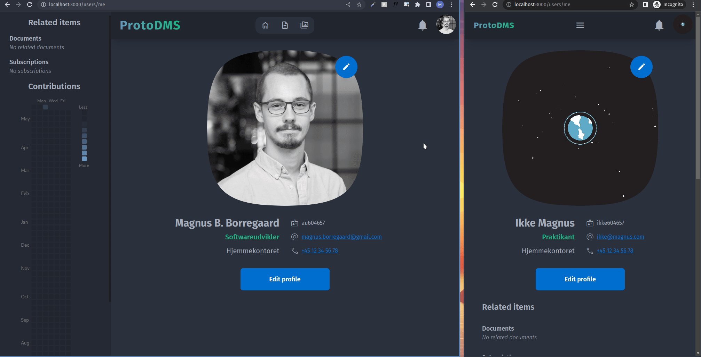

# ProtoDMS
[Live demo kan tilgås her](https://dev3.documents.chcaa.au.dk).

Mangler, begrænsninger og fremtidigt arbeje ved de følgende funktioner adresserer udelukkende tekniske og / eller praktiske emner ved den aktuelle implementering af disse i relation til funktionerne beskrevet i mit speciale. For at læse om yderligere indsigter, der adresserer videndeling i projektbaserede softwareorganisationer henvises der til bilag 3 af mit speciale.

## Registrering
Da den live demo er til demonstrationsformål og ikke har reel data, er der ingen begrænsninger for, hvem der kan oprette en profil.

### Mangler, begrænsninger og fremtidigt arbejde
Inden registrering kan anvendes i produktion, skal det ProtoDMS udbygges til at anvende et beskyttet invitationssystem, hvor kun administratoren eller andre medlemmer kan invitere nye brugere ved at sende en invitations-email. Alternativt kan kan hele adgangen til ProtoDMS (inkl. registrering) beskyttes bag en VPN eller lignende, der kræver autoriseret adgang.

## Relationer & grafvisning
Dokumentation i ProtoDMS organiseres i et netværk af relaterede dokumenter. Dette netværk kan visualiseres med grafvisningsknappen.

### Mangler, begrænsninger og fremtidigt arbejde
* Når relationer tilføjes eller fjernes fra et dokument, opdateres dette ikke straks på dokumentets side (ligesom indholdet af dokumentet ville)
* Grundet vanskeligheder ved at definere tovejs-mange-til-mange-relationer mellem dokumenter (én enkelt SQL-samling) er relationen mellem dokumenter i øjeblikket énvejs
  * Dette betyder, at når dokumenter relateres til hinanden skal dette manuelt gøres to gange (fra hvert dokument) for at relationen mellem de to dokumenter kan ses fra begge dokumenter

## Mærkater & filtrering
Dokumenter kan facetteres og filtreres med brugervalgte mærkater, der kan denotere alt fra dokumenters kontekst til deres indhold og anvendelseskontekst. 

### Mangler, begrænsninger og fremtidigt arbejde
* Det kan potentielt hjælpe informationssøgere med hurtigt at identificere korrekte dokumenter, hvis man ved oprettelsen af mærkater også kan vælge mærkatets farve og / eller ikon

## Private dokumenter
Dokumenter i ProtoDMS kan være enten **private** eller **offentlige**. Offentlige dokumenter kan ses af alle, hvorimod alt ved private dokumenter kun kan ses af den oprettende bruger.

## Deling og skrivebeskyttet deling
Man kan dele et download-link til filer med andre brugere af ProtoDMS, så de ikke selv behøver at fremsøge filen. Man kan også oprette links til en skrivebeskyttet version af dokumentation, der kan sendes til personer uden adgang til ProtoDMS.

### Mangler, begrænsninger og fremtidigt arbejde
* ProtoDMS understøtter i øjeblikket ikke links til "skrivebeskyttede" filer, der kan sendes til personer uden adgang til platformen, da filer af deres natur ikke kan redigeres på ProtoDMS alligevel, og man derfor blot kan downloade en fil og sende den til modtageren igennem andre kanaler
  * Det ville dog være nyttigt at kunne oprette et sådant link, der kan deles med eksterne aktører (evt. via email, så man ikke behøver forlade ProtoDMS)

## Skabeloner
Brugere kan oprette skabeloner for dokumentation ved at tilføje et brugervalgt mærkat (eks. 'skabelon') til almindelige dokumenter og duplikere disse inden udfyldelse.

## Filer og OCR
Filer kan uploades i ProtoDMS' virtuelle filsystem og vedhæftes dokumentation. Indholdet af billedfiler kan dernæst scannes og indsættes i dokumenter for at gøre filindholdet søgbart.

### Mangler, begrænsninger og fremtidigt arbejde
* Oprettelsen af, og navigationen til fildokumentation kan i øjeblikket kun foretages fra dokumenters søgeside, ikke fra en bestemt fil
* Den aktuelle implementering af optisk karaktergenkendelse er lavet med [tesseract.js](https://github.com/naptha/tesseract.js) og kører derfor i klientens browser
  * Dette betyder, at brugere aktivt skal foretage scanningen i stedet for, at den kan foretages i baggrunden på serveren
  * Dette betyder også, at scanningen er begrænset af klientens hardware, hvor serverside-processering har potentiale for at fungere mere effektivt
  * Yderligere understøtter tesseract.js kun en lille håndfuld af billedformater, hvor understøttelse af PDF-formatet ville være en meget brugbar funktionalitet
  * tesseract.js understøtter automatisk rotering af billeder, hvilket ville være en brugbar tilførsel at implementere i ProtoDMS
  * tesseract.js understøtter mange sprog. I øjeblikket er ProtoDMS konfigureret til at genkende dansk og engelsk, men evnen til at kunne konfigurere sprogmodellen ville naturligvis gøre denne funktion brugbar for personer, der ofte uploader filer i andre sprog end disse

## Illustrationer
Hvert dokument har et vedhæftet diagram til at illustrere simple flowcharts, sekvensdiagrammer etc.

#### Mangler, begrænsninger og fremtidigt arbejde
* Grundet den tekniske udformning af diagram-editoren er dette ikke realtids-synkroniseret med andre i samme dokument-session. I stedet skal man først gemme diagrammet, før det kan ses af andre redaktører
* Den implementerede diagram-funktionalitet er meget simpel og kan kun anvendes til simple flowcharts og sekvensdiagrammer (etc.)
  * En indlejret draw.io-editor vil tillade mere komplekse diagrammer (såsom UML-diagrammer), hvilket kan bruges til at understøtte præsentationen af langt flere softwareudviklingrelaterede emner
    * draw.io kræver dog at illustrationer gemmes i et specifikt format, der potentielt påkræver en server til lagring af disse, medmindre kildekoden af draw.io approprieres
  * Ideelt vil denne funktionalitet bestå af en editor magen til [Figmas](https://www.figma.com/), hvor arbitrære illustrationer (f.eks. også UI-designs og lignende) kan gemmes og arbejdes på i realtid med andre kollaboratører
* Grundet den tekniske udformning af diagram-editoren er det vanskeligt at have flere editors på samme side. Det ville være brugbart at kunne tilføje / fjerne fra en liste over arbitrære illustrationer med hver sin titel

### Realtidskollaboration

### Mangler, begrænsninger og fremtidigt arbejde

## Personopsøgning, versionshistorik og bidragsscore

### Mangler, begrænsninger og fremtidigt arbejde

## Fuldtekstsøgning

### Mangler, begrænsninger og fremtidigt arbejde

## Abonnementer

### Mangler, begrænsninger og fremtidigt arbejde
